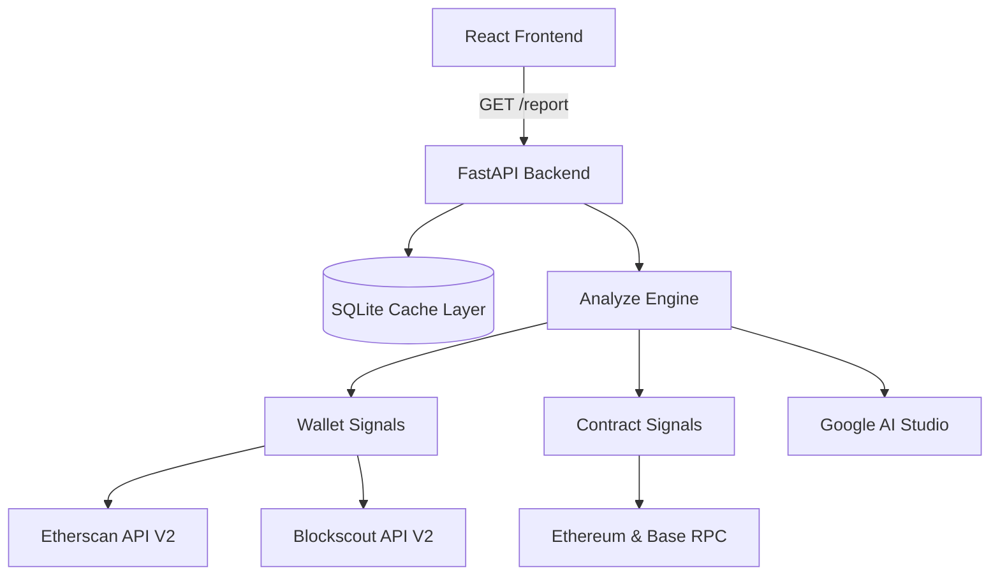

<![CDATA[# 🛡️ Trust Trails

**Trust Trails** is a cross-chain risk analysis engine that democratizes Web3 security.

Drop in any wallet or smart contract address and get an instant, human-readable risk report — backed by **cryptographic proof** (on-chain transaction hashes, block numbers, and smart contract state). Trust Trails scans interaction history across **Ethereum**, **Base**, and **Arbitrum** to generate a deterministic **0–100 Trust Score**.

---

## ✨ Features

| Feature | Description |
|---|---|
| 🔍 **Cross-Chain Scanning** | Analyzes wallet & contract activity across Ethereum, Base, and Arbitrum simultaneously |
| 📊 **Trust Score (0–100)** | Deterministic, rule-based scoring — no AI influence on the score itself |
| 🧠 **AI-Powered Summaries** | Uses Google AI Studio to narrate the final report in plain English |
| 🕸️ **Interaction Graph** | Cytoscape.js-powered visual map of wallet interactions and laundering topologies |
| ⚡ **Smart Caching** | SQLite caching layer with rate-limit handling and automatic retries |
| 🔐 **On-Chain Verification** | Direct RPC state inspection (e.g., EIP-1967 proxy detection via storage slots) |

---

## 🏗️ Architecture



---

## 🚀 Getting Started

### Prerequisites

- **Python 3.10+**
- **Node.js 18+** and **npm**

### 1. Clone the Repository

```bash
git clone https://github.com/Vpystudent/TrustTrails.git
cd TrustTrails
```

### 2. Backend Setup

```bash
# Create and activate a virtual environment
python -m venv venv

# Windows
.\venv\Scripts\activate

# macOS / Linux
source venv/bin/activate

# Install dependencies
pip install -r requirements.txt
```

### 3. Environment Variables

Create a `.env` file in the project root with the following keys:

| Variable | Description | Required |
|---|---|---|
| `ETHERSCAN_API_KEY` | Your Etherscan API key | Yes |
| `LLM_API_KEY` | Google AI Studio API key | Yes |
| `LLM_MODEL` | LLM model name (default: `gemini-3.8-flash`) | No |
| `OFFLINE` | Set to `1` to run in offline/mock mode | No |

### 4. Frontend Setup

```bash
cd frontend
npm install
```

---

## ▶️ Running the Application

Start both servers in **separate terminals**:

**Terminal 1 — Backend API:**

```bash
.\venv\Scripts\uvicorn backend.main:app --host 0.0.0.0 --port 8000
```

**Terminal 2 — Frontend UI:**

```bash
cd frontend
npm run dev
```

Then open **[http://localhost:5173](http://localhost:5173)** in your browser.

---

## 🧪 Testing

Run the automated test suite to verify the scoring engine and signal heuristics:

```bash
pytest
```

The test suite covers:
- Scoring engine mathematical invariants (points always sum correctly)
- API endpoint integration tests
- Wallet signal detection logic

There is also a custom evaluation script (`scripts/run_eval.py`) that tests recall and precision against a blind dataset of known scams.

---

## 🧩 Tech Stack

| Layer | Technology |
|---|---|
| Frontend | React, Vite, Cytoscape.js |
| Backend | Python, FastAPI, Uvicorn |
| Data | Etherscan V2 API, Blockscout V2 API, Ethereum RPC |
| AI | Google AI Studio (Gemini) |
| Caching | SQLite |
| Testing | Pytest |

---

## ⚠️ Known Limitations

- **EVM Only** — Currently supports only EVM-compatible chains.
- **Off-chain Signatures** — Cannot detect off-chain Permit signature approvals (they emit no logs until execution).
- **History Cap** — APIs paginate up to 10,000 records per address. Very active wallets (e.g., exchange hot wallets) will trigger a "History Truncated" warning.

---

## 📄 License

This project was built for a hackathon. See the repository for license details.
]]>
